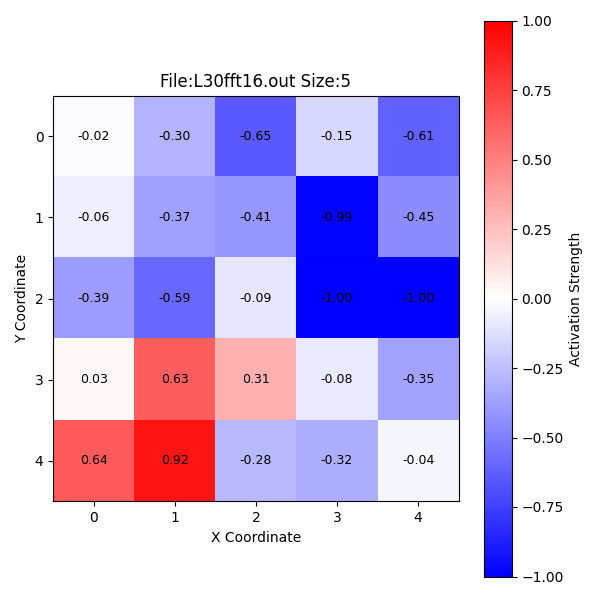

# Self-Organizing Maps (SOM) and their applications in motor validation

This project implements a Self-Organizing Map
(SOM) to visualize the distribution of good and bad motors
in the provided motor dataset. The SOM organises the motor
data into a 2D topology, and places similar vectors closer
together. A neighborhood function using toroidal (wrap around)
distance along with a time decaying learning rate is used to
generate the weight matrix. Then after the vectors are all set, an
activation map (which acts as a heat map) is created to properly
visualize the good and bad motors. The effectiveness of SOM’s in
differentiating good and bad motors is tested with testing three
topologies: 5x5, 6x6, 7x7 and two input vector sizes (16 and 32
samples).

